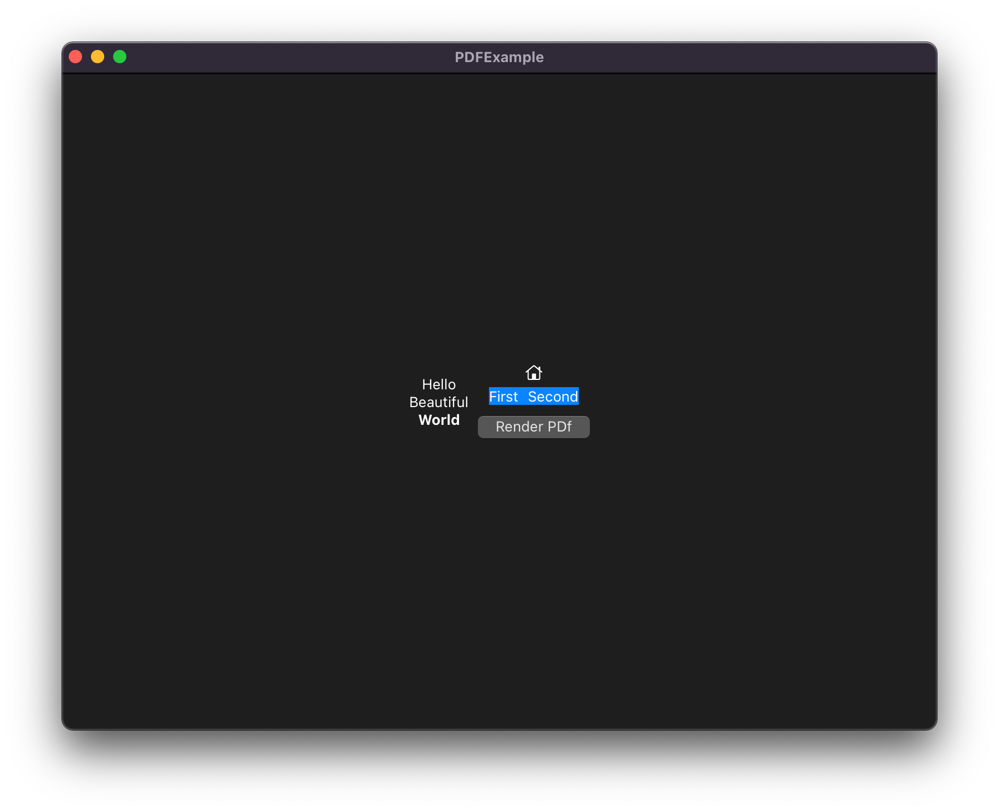
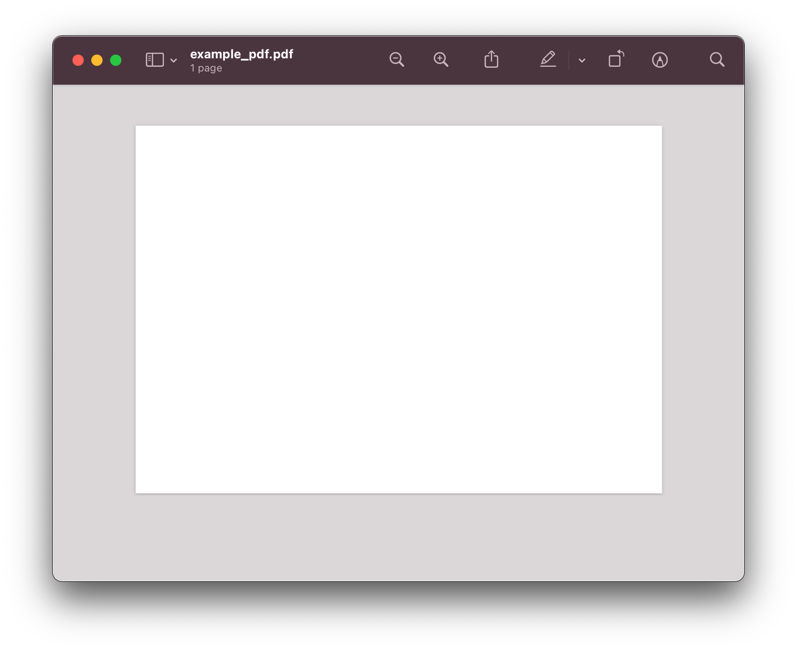

# Try to Render SwiftUI to PDF

This tries to render a SwiftUI View (in iPadOS / Catalyst) to a PDF. It doesn't work.

### Here's what the UI looks like:

### Here's what the generated PDF looks like

